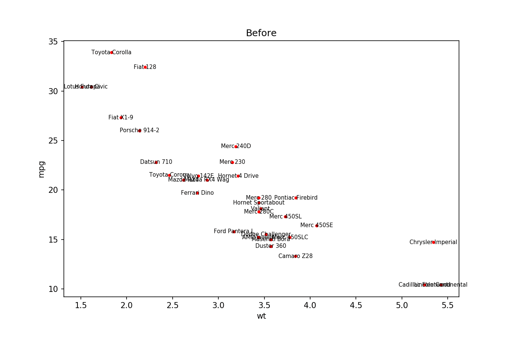

[](http://adjusttext.readthedocs.io/en/latest/?badge=latest)  [](https://gitter.im/adjustText/Lobby)

Inspired by **ggrepel** package for R/ggplot2 (https://github.com/slowkow/ggrepel) 


The idea is that often when we want to label multiple points on a graph the text will start heavily overlapping with both other labels and data points. This can be a major problem requiring manual solution. However this can be largely automatized by smart placing of the labels (difficult) or iterative adjustment of their positions to minimize overlaps (relatively easy). This library (well... script) implements the latter option to help with matplotlib graphs. Usage is very straightforward with usually pretty good results with no tweaking (most important is to just make text slightly smaller than default and maybe the figure a little larger). However the algorithm itself is highly configurable for complicated plots.

There is a simple documentation now, thanks to Christophe Van Neste @beukueb!

http://adjusttext.readthedocs.io/en/latest/

Should be installable from pypi:
```
pip install adjustText
```
Or with `conda`:
```
conda install -c phlya adjusttext 
```

For the latest version from github:
```
pip install https://github.com/Phlya/adjustText/archive/master.zip
```

See [wiki] for some basic introduction, and more advanced usage examples [here].

[wiki]: https://github.com/Phlya/adjustText/wiki
[here]: https://github.com/Phlya/adjustText/blob/master/docs/source/Examples.ipynb
